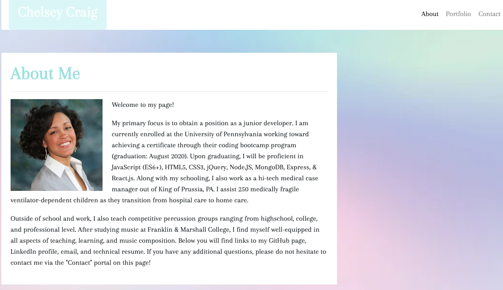

# Responsive Portfolio

Get to kow me and find out who I am!
___

## Description

In my responsive portfolio I created an interactive page that showcases my coding skills while giving the viewer the opportunity to learn a little bit more about who I am. The page has a number of features that give the user insight into the works I have produced and also has links enbedded into the page for further communication.
___

## How It Works

Upon clicking on the deployed link, the user will be greeted with an "About Me" page that contains a picture of myself as well as background information regarding who I am, what I am currently achieving, and my future goals. To create a uniform viewing experience, I was sure to link my background image, bootstrap, google fonts, CSS page, and font awesome into call three of my HTML pages. I also made sure to link each of the three HTML pages to each other to ensure that the links on the right of the navigation bar would be active each time the user wanted to go to a new page within the site.  I also redirected the page back to the home page using the name button located on the left side of the navigation bar. To make it more obvious for the user that it was a usable link, I changed the opacity on the hover to ensure that the user would know how to use this particular button.

On this opening page, I utilized bootstrap to form the navigation bar as well as format the container.  From there, I used both HTML and CSS to format the look of the box, the alignment of the picture, and layout of the text.

While on this page, the user has the option of navigating to either the Portfolio or Contact page as shown in the navigate bar. Another option the user can utilize at anytime are the links found in the footer of this page. The icons shown are direct links to my personal GitHub page, Linked In page, email, and technical resume. This was achieved by using a-tags to define the links and enter the font awesome icons. From there, I updated the CSS page to make the icons larger, align them properly in the footer, and create a hover affect.

The next logical step for the user would be to go to the Portfolio page. This is a showcase of some of the projects, homework assignments, and activities I have completed throughout this class. I used the bootstrap panel class to create the white box that contained my works. To create the assignment boxes, I used CSS to create the shape I wanted and HTML to add in the images.  I also placed an overlay over each image that contains the name of each project.  In order to create a better visual experience, I set the opacity to only 90% to begin and reduced the font size and opacity even more when the user hovers over the overlay.  Not only are these images layed out well by working with the grid system available through bootstrap, they are also working links that will take the user to each separate project.  I used "target='_blank' " to open up an new HTML page once the link is selected in order to not interrupt the user experience.

The last page for the user to view is the Contact page.  This page give the user the opportunity to enter in their name, email address, and a message to be sent to me through email. I created a "Submit" button that is set to link to my personal email account. Once again, I utilized the panel class in bootstrap to create the display box, but I also experimented with a variety of form-tags to create the large and small rectangular boxes shown.  Another aspect I incorporated was the use of placeholders to give the user a better understanding of what to write in each of the boxes.

Other updates for this assignment included an updated technical resume, updated GitHub profile with links to this project, updated LinkedIn profile, and showcasing of pins on GitHub.

___

## Link to Project

https://ccraig7321.github.io/Responsive-Portfolio/

___

## Technologies

- HTML
- CSS
- Bootstrap
- Font Awesome
- Google Fonts
- Visual Studio Code

___

### License

Copyright 2020 CHELSEY CRAIG

Permission is hereby granted, free of charge, to any person obtaining a copy of this software and associated documentation files (the "Software"), to deal in the Software without restriction, including without limitation the rights to use, copy, modify, merge, publish, distribute, sublicense, and/or sell copies of the Software, and to permit persons to whom the Software is furnished to do so, subject to the following conditions:

The above copyright notice and this permission notice shall be included in all copies or substantial portions of the Software.

THE SOFTWARE IS PROVIDED "AS IS", WITHOUT WARRANTY OF ANY KIND, EXPRESS OR IMPLIED, INCLUDING BUT NOT LIMITED TO THE WARRANTIES OF MERCHANTABILITY, FITNESS FOR A PARTICULAR PURPOSE AND NONINFRINGEMENT. IN NO EVENT SHALL THE AUTHORS OR COPYRIGHT HOLDERS BE LIABLE FOR ANY CLAIM, DAMAGES OR OTHER LIABILITY, WHETHER IN AN ACTION OF CONTRACT, TORT OR OTHERWISE, ARISING FROM, OUT OF OR IN CONNECTION WITH THE SOFTWARE OR THE USE OR OTHER DEALINGS IN THE SOFTWARE.